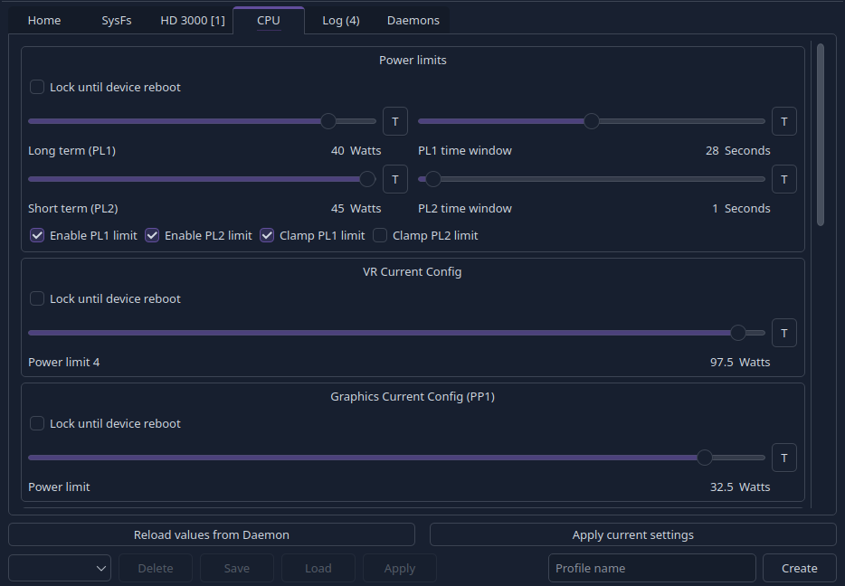

# PowerTuner Client


PowerTuner desktop client, classic desktop UI with mouse/keyboard controls.

For a command-line client, see [PowerTunerCLI](https://github.com/PowerTuner/PowerTunerCLI)

For a gamepad first client and couch gaming, see [PowerTunerConsole](https://github.com/PowerTuner/PowerTunerConsole)

## How to start

Go to **Daemons** tab and connect to **local** daemon,
or add a new daemon if you installed the daemon/service in another device and want to connect to it.

## Custom input ranges for settings

Some settings like TDP or GPU clock, use a json database with min/max ranges.

Built-in ranges are safe, not exceeding the default/recommended values for the device.

### Create custom ranges override file

Create a new ranges json file for your device.

```text
<powerTuner data path>\inputRanges\<device dmi id>.json
```

Replace _\<powerTuner data path\>_ with the global client data path, which is printed in _Log_ tab on client boot.

Usually, the path should be:

```text
Windows:
C:\Users\<username>\AppData\Local\PowerTuner

Linux:
/home/<username>/.local/share/PowerTuner
```

Create the **inputRanges** folder if it does not exist (**case sensitive**).

Replace _\<device dmi id\>_ with the DMI product.

Example file:

```text
C:\Users\jake\AppData\Local\PowerTuner\inputRanges\G1618-04.json
```

### Ranges file structure

This is the structure of a ranges json file.

```json
{
  "#comment": "gpd win 4 6800u",
  "AMD Ryzen 7 6800U": {
    "radj_pl": {
      "min": 5000,
      "max": 32000
    },
    "radj_apu_slow": {
      "min": 5000,
      "max": 32000
    }
  }
}
```

A single device block is like this:

```text
  "CPU string or substring to match to correctly identify the device": {
    "range_type": {
      "min": value,
      "max": value
    }
  }
```

In cases where multiple devices share the same DMI id, add them to the same ranges file.

```json
{
  "AMD Ryzen 7 6800U": {
    "radj_pl": {
      "min": 5000,
      "max": 5000
    }
  },
  "AMD Ryzen 7 8840U": {
    "radj_pl": {
      "min": 7000,
      "max": 7000
    }
  }
}
```

Use **#comment** key at the top level to add comments, these are ignore when parsing.

### Available range types

```text
AMD RyzenAdj
    radj_pl:                    TDP (slow/fast/stapm)
    radj_tctl:                  Tctl Temperature Limit
    radj_apu_slow:              APU PPT Slow Power limit for A+A dGPU platform
    apu_skin_temp:              APU Skin Temperature Limit
    radj_dgpu_skin_temp:        dGPU Skin Temperature Limit
    radj_vrm_current:           VRM Current Limit
    radj_vrm_soc_current:       VRM SoC Current Limit
    radj_gfx_clock:             GPU Frequency Limit
    radj_co:                    Curve Optimizer Limit
    
Intel
    intl_pl:                    TDP (pl1, pl2)
    intl_pl4:                   Pl4 Limit
    intl_pp1:                   Graphics Current Config
    intl_fivr:                  Undervolt Limit
    intl_turbo_pwr_current_tdp: Turbo Power Current - TDP Limit
    intl_turbo_pwr_current_tdc: Turbo Power Current - TDC Limit
```

_from [inputRanges.h](https://github.com/PowerTuner/libPWTClientCommon/blob/main/pwtClientCommon/InputRanges/InputRanges.h)_

You can find built-in ranges [here](https://github.com/PowerTuner/commonResources/tree/main/inputRanges)

### Load your custom ranges

Press the reload button to load your overrides, if the client is running.

## Daemon settings

Once a daemon is connected, you can change its settings in **Daemons** tab -> **right panel** -> **Settings**.

## Build

clone this repo:
```bash
git clone --recursive https://github.com/PowerTuner/PowerTunerClient.git
```

Build options:

```text
WITH_INTEL
enable building of client UI for Intel CPU settings, default ON

WITH_AMD
enable building of client UI for AMD CPU settings, default ON
```

### Linux

requirements:

- gcc or clang
- cmake
- qt6-base

```text
$ cd PowerTunerClient
$ cmake -B build -DCMAKE_BUILD_TYPE=Release
$ make -C build
```

### Windows

requirements:

- Visual Studio 2022 with the component **Desktop development with C++** installed
- [Windows terminal](https://apps.microsoft.com/detail/9n0dx20hk701)
- [latest Qt](https://www.qt.io/development/download-qt-installer-oss) with **MSVC 2022 64bit** installed

Open terminal and create a new instance of **Developer Command Promp for VS 2022** or **Developer PowerShell for VS 2022**.

_Tab completition feature is only available in PowerShell_

```text
$ cd PowerTunerClient
$ cmake -B build -DCMAKE_BUILD_TYPE=Release -DCMAKE_PREFIX_PATH="<path to Qt>\msvc2022_64\lib\cmake" -G "Ninja"
$ ninja -C build
```

Replace _\<path to Qt\>_ with your Qt root path, default is **C:\Qt\\<Qt version\>**

---



_Linux Intel device screenshot_
